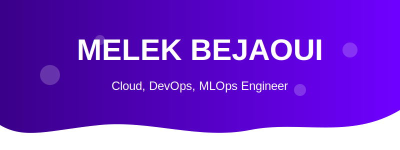

<div align="center">
  
</div>

<div align="center">
  
  [](https://www.linkedin.com/in/melek-bejaoui/)
  [](mailto:melek.bejaoui@esprit.tn)
  [](https://melekbj.github.io)
  [](https://github.com/melekbj)
  
</div>

<p align="center">
  
</p>

---

<div align="center">
  
  
</div>

---

## <div align="center">🚀 ABOUT ME</div>

<div align="center">
  
</div>

<div align="center">
  
</div>

Software Engineer focused on building the future of infrastructure. I specialize in **Cloud Architecture** and **DevOps practices** while maintaining a strong foundation in software development. I create automated, scalable, and resilient systems that bridge the gap between development and operations.

```python
class CloudDevOpsEngineer:
    def __init__(self):
        self.name = "Melek Bejaoui"
        self.role = "Cloud &amp; DevOps Engineer"
        self.language_spoken = ["en_US", "fr_FR", "ar_TN"]
        self.code = ["Python", "Go", "JavaScript", "Bash", "HCL"]
        self.tools = ["Kubernetes", "Docker", "Terraform", "AWS", "CI/CD"]
        
    def say_hi(self):
        print("Thanks for visiting my GitHub! Let's build something amazing together.")
        
me = CloudDevOpsEngineer()
me.say_hi()
```

---

## <div align="center">⚡ TECH STACK</div>

<div align="center">
  
</div>

<div align="center">
  
</div>

---

## <div align="center">🏆 PROJECTS</div>

<div align="center">
  <a href="https://github.com/melekbj/PFE_TT_ScoreHub_Frontend">
    
  </a>
  <a href="https://github.com/melekbj/DEVOPS_PROJECT">
    
  </a>
</div>

<br/>

<div align="center">
  
  <strong>Featured Projects:</strong>
</div>

- **🔹 ScoreHub Frontend (PFE_TT_ScoreHub_Frontend)**
  <br>A modern web application for tracking scores and statistics built using React with a focus on responsive design and real-time updates.
  
- **🔹 DevOps Pipeline Implementation (DEVOPS_PROJECT)**
  <br>End-to-end CI/CD pipeline using Jenkins, Docker, and Kubernetes for automating build, test, and deployment processes.
  
- **🔹 Multi-Cloud Infrastructure Framework**
  <br>Modular IaC solution ensuring consistent infrastructure provisioning across AWS, Azure, and GCP with built-in compliance checks.

<div align="center">
  
</div>

---

## <div align="center">📊 CODING ACTIVITY</div>

<div align="center">
  
</div>

<div align="center">
  
</div>

---

## <div align="center">🌱 CURRENTLY LEARNING</div>

<div align="center">
  
  
  
  
  
  
</div>

<div align="center">
  
</div>

---

## <div align="center">📫 CONNECT WITH ME</div>

<div align="center">
  
  <p>I'm always interested in collaborating on innovative projects and connecting with fellow tech enthusiasts.</p>
  
  <a href="mailto:melek.bejaoui@esprit.tn">
    
  </a>
</div>

---

<div align="center">
  
</div>

<div align="center">
  <h3>⚡ "Infrastructure as code, culture as practice, and automation as a way of life." ⚡</h3>
</div>
